# DIMENSION 2.5  


<div align="center">

```
██████╗ ██╗███╗   ███╗███████╗███╗   ██╗███████╗██╗ ██████╗ ███╗   ██╗    ██████╗      ███████╗
██╔══██╗██║████╗ ████║██╔════╝████╗  ██║██╔════╝██║██╔═══██╗████╗  ██║    ╚════██╗     ██╔════╝
██║  ██║██║██╔████╔██║█████╗  ██╔██╗ ██║███████╗██║██║   ██║██╔██╗ ██║     █████╔╝     ███████╗
██║  ██║██║██║╚██╔╝██║██╔══╝  ██║╚██╗██║╚════██║██║██║   ██║██║╚██╗██║    ██╔═══╝      ╚════██║
██████╔╝██║██║ ╚═╝ ██║███████╗██║ ╚████║███████║██║╚██████╔╝██║ ╚████║    ███████╗ ██║ ███████║
╚═════╝ ╚═╝╚═╝     ╚═╝╚══════╝╚═╝  ╚═══╝╚══════╝╚═╝ ╚═════╝ ╚═╝  ╚═══╝    ╚══════╝ ╚═╝ ╚══════╝

```

### *🌟 WHERE 2D MATHEMATICS CREATES 3D MAGIC 🌟*

[](https://dimension-2-5.vercel.app/)
[](https://github.com/thehardiik/Dimension-2.5)
</div>

---

## 💥 WHAT THE HELL IS THIS?

**DIMENSION 2.5** is not your average project. It's a **MIND-BENDING RAYCASTING ENGINE** that takes boring 2D map and transforms it into **SICK 3D VISUALS** that will make your brain question reality!

<div align="center">


</div>


## 🤓 FOR THE NERDS (MATHEMATICAL BREAKDOWN)

### Line-Segment Intersection (The Holy Grail)
```javascript
const den = (x1-x2)*(y3-y4) - (y1-y2)*(x3-x4);
const t = ((x1-x3)*(y3-y4) - (y1-y3)*(x3-x4))/den;
const u = -((x1-x2)*(y1-y3) - (y1-y2)*(x1-x3))/den;

// If t ∈ (0,1) && u > 0 → COLLISION DETECTED! 💥
```

### Distance to Height Mapping
```javascript
// The equation that creates depth perception:
const visualHeight = FOV_CONSTANT / (distance * tan(FOV_ANGLE));
```

## 🎬 HOW IT WORKS (THE BREAKDOWN)

```mermaid
graph TD
    A[🎯 Player at Position] -->|Cast| B[⚡ 60 Rays in Arc]
    B -->|Check| C[🧱 Wall Intersections]
    C -->|Calculate| D[📏 Ray Distances]
    D -->|Map| E[📊 Visual Heights]
    E -->|Render| F[🎪 3D-like Scene]
    F -->|Loop| A
```




## 🌐 CONNECT WITH THE CREATOR

<div align="center">

[](https://www.linkedin.com/in/hardik-srivastav-164728252/)
[](https://github.com/thehardiik)

**Dhanyawad**

</div>


